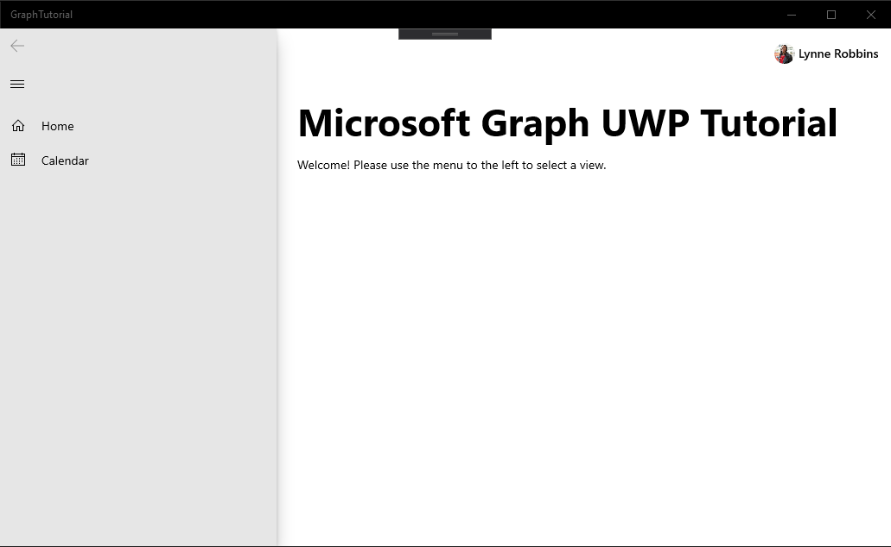

<!-- markdownlint-disable MD002 MD041 -->

In this exercise you will extend the application from the previous exercise to support authentication with Azure AD. This is required to obtain the necessary OAuth access token to call the Microsoft Graph. In this step you will integrate the **LoginButton** control from the [Windows Graph Controls](https://github.com/windows-toolkit/Graph-Controls) into the application.

1. Right-click the **GraphTutorial** project in Solution Explorer and select **Add > New Item...**. Choose **Resources File (.resw)**, name the file `OAuth.resw` and select **Add**. When the new file opens in Visual Studio, create two resources as follows.

    - **Name:** `AppId`, **Value:** the app ID you generated in Application Registration Portal
    - **Name:** `Scopes`, **Value:** `User.Read Calendars.Read`

    

    > [!IMPORTANT]
    > If you're using source control such as git, now would be a good time to exclude the `OAuth.resw` file from source control to avoid inadvertently leaking your app ID.

## Configure the LoginButton control

1. Open `MainPage.xaml.cs` and add the following `using` statement to the top of the file.

    ```csharp
    using Microsoft.Toolkit.Graph.Providers;
    ```

1. Replace the existing constructor with the following.

    ```csharp
    public MainPage()
    {
        this.InitializeComponent();

        // Load OAuth settings
        var oauthSettings = Windows.ApplicationModel.Resources.ResourceLoader.GetForCurrentView("OAuth");
        var appId = oauthSettings.GetString("AppId");
        var scopes = oauthSettings.GetString("Scopes");

        if (string.IsNullOrEmpty(appId) || string.IsNullOrEmpty(scopes))
        {
            Notification.Show("Could not load OAuth Settings from resource file.");
        }
        else
        {
            // Configure MSAL provider
            MsalProvider.ClientId = appId;
            MsalProvider.Scopes = new ScopeSet(scopes.Split(' '));

            // Handle auth state change
            ProviderManager.Instance.ProviderUpdated += ProviderUpdated;

            // Navigate to HomePage.xaml
            RootFrame.Navigate(typeof(HomePage));
        }
    }
    ```

    This code loads the settings from `OAuth.resw` and initializes the MSAL provider with those values.

1. Now add an event handler for the `ProviderUpdated` event on the `ProviderManager`. Add the following function to the `MainPage` class.

    ```csharp
    private void ProviderUpdated(object sender, ProviderUpdatedEventArgs e)
    {
        var globalProvider = ProviderManager.Instance.GlobalProvider;
        SetAuthState(globalProvider != null && globalProvider.State == ProviderState.SignedIn);
        RootFrame.Navigate(typeof(HomePage));
    }
    ```

    This event triggers when the provider changes, or when the provider state changes.

1. In Solution Explorer, expand **HomePage.xaml** and open `HomePage.xaml.cs`. Add the following code after the `this.InitializeComponent();` line.

    ```csharp
    if ((App.Current as App).IsAuthenticated)
    {
        HomePageMessage.Text = "Welcome! Please use the menu to the left to select a view.";
    }
    ```

1. Restart the app and click the **Sign In** control at the top of the app. Once you've signed in, the UI should change to indicate that you've successfully signed-in.

    

    > [!NOTE]
    > The `ButtonLogin` control implements the logic of storing and refreshing the access token for you. The tokens are stored in secure storage and refreshed as needed.
