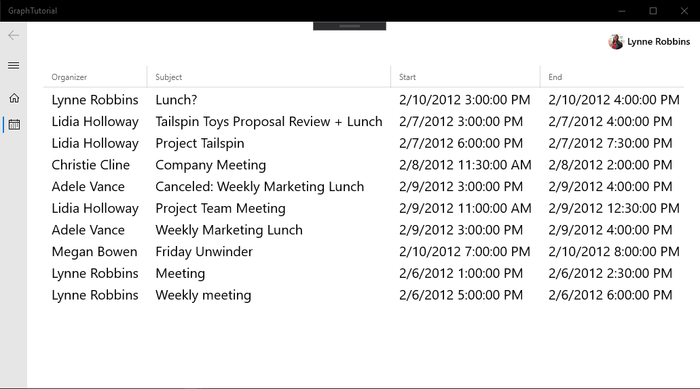

<!-- markdownlint-disable MD002 MD041 -->

In this exercise you will incorporate the Microsoft Graph into the application. For this application, you will use the [Microsoft Graph Client Library for .NET](https://github.com/microsoftgraph/msgraph-sdk-dotnet) to make calls to Microsoft Graph.

## Get calendar events from Outlook

1. Add a new page for the calendar view. Right-click the **GraphTutorial** project in Solution Explorer and select **Add > New Item...**. Choose **Blank Page**, enter `CalendarPage.xaml` in the **Name** field, and select **Add**.

1. Open `CalendarPage.xaml` and add the following line inside the existing `<Grid>` element.

    ```xaml
    <TextBlock x:Name="Events" TextWrapping="Wrap"/>
    ```

1. Open `CalendarPage.xaml.cs` and add the following `using` statements at the top of the file.

    ```csharp
    using Microsoft.Toolkit.Graph.Providers;
    using Microsoft.Toolkit.Uwp.UI.Controls;
    using Newtonsoft.Json;
    ```

1. Add the following functions to the `CalendarPage` class.

    ```csharp
    private void ShowNotification(string message)
    {
        // Get the main page that contains the InAppNotification
        var mainPage = (Window.Current.Content as Frame).Content as MainPage;

        // Get the notification control
        var notification = mainPage.FindName("Notification") as InAppNotification;

        notification.Show(message);
    }

    protected override async void OnNavigatedTo(NavigationEventArgs e)
    {
        // Get the Graph client from the provider
        var graphClient = ProviderManager.Instance.GlobalProvider.Graph;

        try
        {
            // Get the events
            var events = await graphClient.Me.Events.Request()
                .Select("subject,organizer,start,end")
                .OrderBy("createdDateTime DESC")
                .GetAsync();

            // TEMPORARY: Show the results as JSON
            Events.Text = JsonConvert.SerializeObject(events.CurrentPage);
        }
        catch(Microsoft.Graph.ServiceException ex)
        {
            ShowNotification($"Exception getting events: {ex.Message}");
        }

        base.OnNavigatedTo(e);
    }
    ```

    Consider with the code in `OnNavigatedTo` is doing.

    - The URL that will be called is `/v1.0/me/events`.
    - The `Select` function limits the fields returned for each events to just those the view will actually use.
    - The `OrderBy` function sorts the results by the date and time they were created, with the most recent item being first.

1. Modify the `NavView_ItemInvoked` method in the `MainPage.xaml.cs` file to replace the existing `switch` statement with the following.

    :::code language="csharp" source="../demo/GraphTutorial/MainPage.xaml.cs" id="SwitchStatementSnippet" highlight="4":::

You can now run the app, sign in, and click the **Calendar** navigation item in the left-hand menu. You should see a JSON dump of the events on the user's calendar.

## Display the results

1. Replace the entire contents of `CalendarPage.xaml` with the following.

    ```xaml
    <Page
        x:Class="GraphTutorial.CalendarPage"
        xmlns="http://schemas.microsoft.com/winfx/2006/xaml/presentation"
        xmlns:x="http://schemas.microsoft.com/winfx/2006/xaml"
        xmlns:local="using:GraphTutorial"
        xmlns:d="http://schemas.microsoft.com/expression/blend/2008"
        xmlns:mc="http://schemas.openxmlformats.org/markup-compatibility/2006"
        xmlns:controls="using:Microsoft.Toolkit.Uwp.UI.Controls"
        mc:Ignorable="d"
        Background="{ThemeResource ApplicationPageBackgroundThemeBrush}">

        <Grid>
            <controls:DataGrid x:Name="EventList" Grid.Row="1"
                    AutoGenerateColumns="False">
                <controls:DataGrid.Columns>
                    <controls:DataGridTextColumn
                            Header="Organizer"
                            Width="SizeToCells"
                            Binding="{Binding Organizer.EmailAddress.Name}"
                            FontSize="20" />
                    <controls:DataGridTextColumn
                            Header="Subject"
                            Width="SizeToCells"
                            Binding="{Binding Subject}"
                            FontSize="20" />
                    <controls:DataGridTextColumn
                            Header="Start"
                            Width="SizeToCells"
                            Binding="{Binding Start.DateTime}"
                            FontSize="20" />
                    <controls:DataGridTextColumn
                            Header="End"
                            Width="SizeToCells"
                            Binding="{Binding End.DateTime}"
                            FontSize="20" />
                </controls:DataGrid.Columns>
            </controls:DataGrid>
        </Grid>
    </Page>
    ```

1. Open `CalendarPage.xaml.cs` and replace the `Events.Text = JsonConvert.SerializeObject(events.CurrentPage);` line with the following.

    ```csharp
    EventList.ItemsSource = events.CurrentPage.ToList();
    ```

    If you run the app now and select the calendar, you should get a list of events in a data grid. However, the **Start** and **End** values are displayed in a non-user-friendly manner. You can control how those values are displayed by using a [value converter](https://docs.microsoft.com/uwp/api/Windows.UI.Xaml.Data.IValueConverter).

1. Right-click the **GraphTutorial** project in Solution Explorer and select **Add > Class...**. Name the class `GraphDateTimeTimeZoneConverter.cs` and select **Add**. Replace the entire contents of the file with the following.

    :::code language="csharp" source="../demo/GraphTutorial/GraphDateTimeTimeZoneConverter.xaml.cs" id="ConverterSnippet":::

    This code takes the [dateTimeTimeZone](/graph/api/resources/datetimetimezone?view=graph-rest-1.0) structure returned by Microsoft Graph and parses it into a `DateTimeOffset` object. It then converts the value into the user's time zone and returns the formatted value.

1. Open `CalendarPage.xaml` and add the following **before** the `<Grid>` element.

    :::code language="xaml" source="../demo/GraphTutorial/CalendarPage.xaml" id="ResourcesSnippet":::

1. Replace the last two `DataGridTextColumn` elements with the following.

    :::code language="xaml" source="../demo/GraphTutorial/CalendarPage.xaml" id="BindingSnippet" highlight="4,9":::

1. Run the app, sign in, and click the **Calendar** navigation item. You should see the list of events with the **Start** and **End** values formatted.

    
